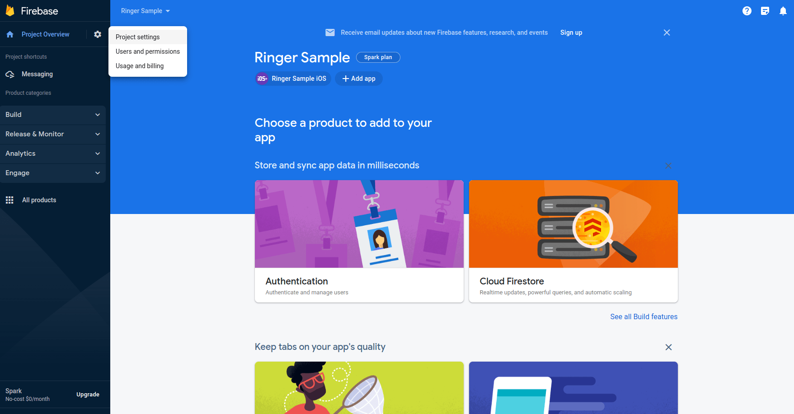
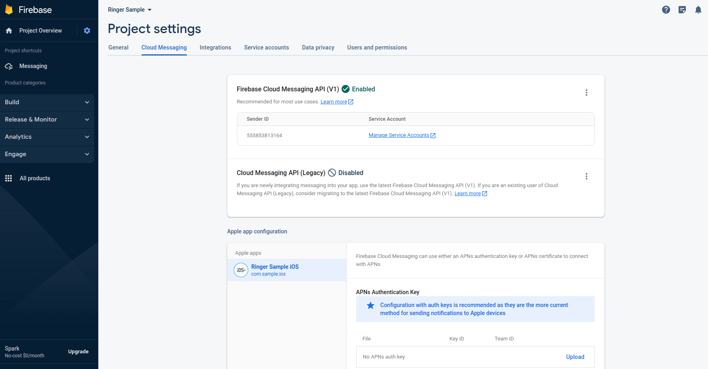
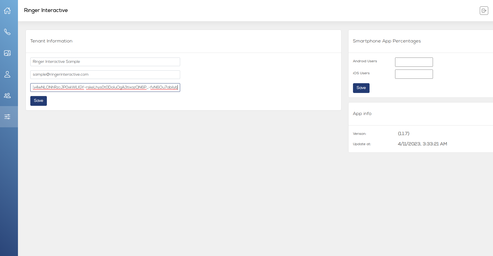

# Adding Firebase server key

1. Visit https://console.firebase.google.com/ and log in with your desired associate
company Google account. Go to project setting

2. Select 'Cloud Meesaging' tab you will see server key token copy that value

2. Login to Ringer Portal go to setting. Fill your information include Firebase token afther that click save.

