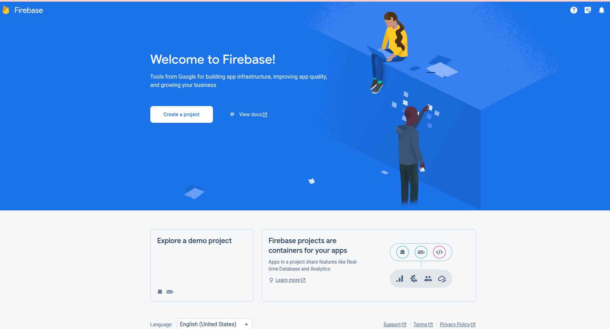
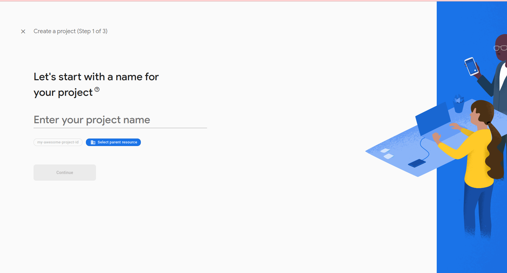
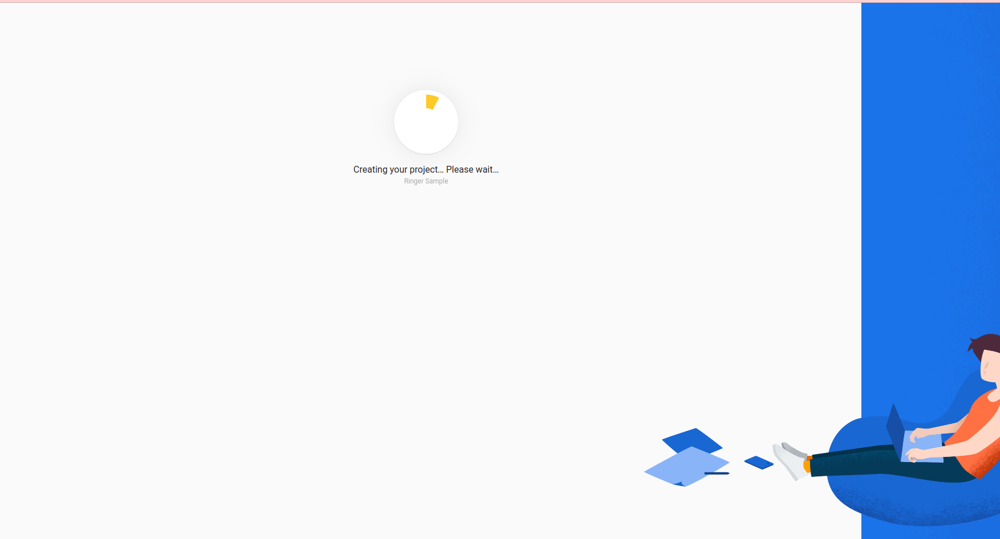
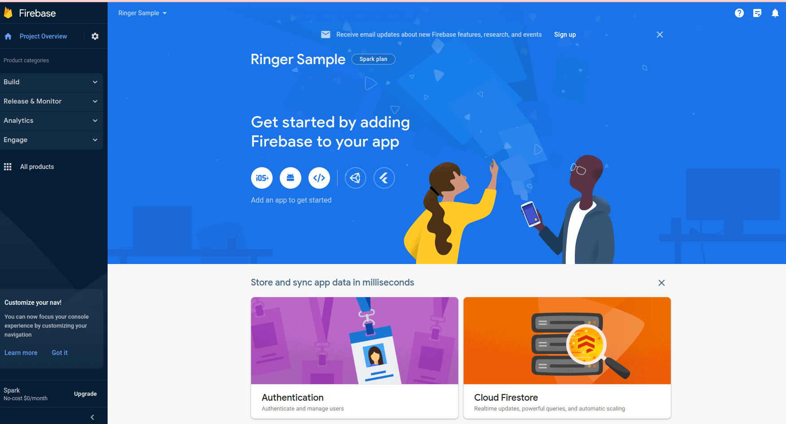

# Create Firbase Token 

:::tip My tip
You should have a google account and create Firebase Token first
:::

## Account Creation Instructions:

1. Visit https://console.firebase.google.com/ and log in with your desired associate
company Google account.

2. Click on “Add Project”.

3. Enter Your Project Name then click “Continue”.

4. Disable the switch titled “Enable Google Analytics for this project” then click on the
“Create Project” button.

5. Click “Continue”.

6. After this you should see three options on your screen - Symbols for Android, IOS and
Web.

