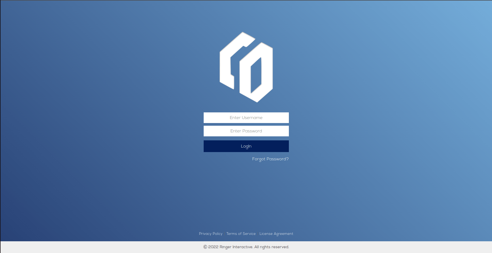
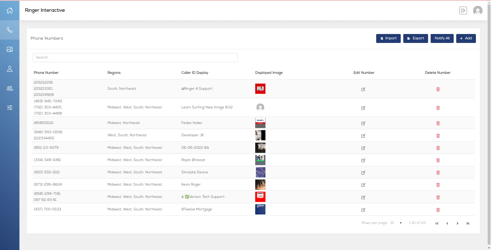
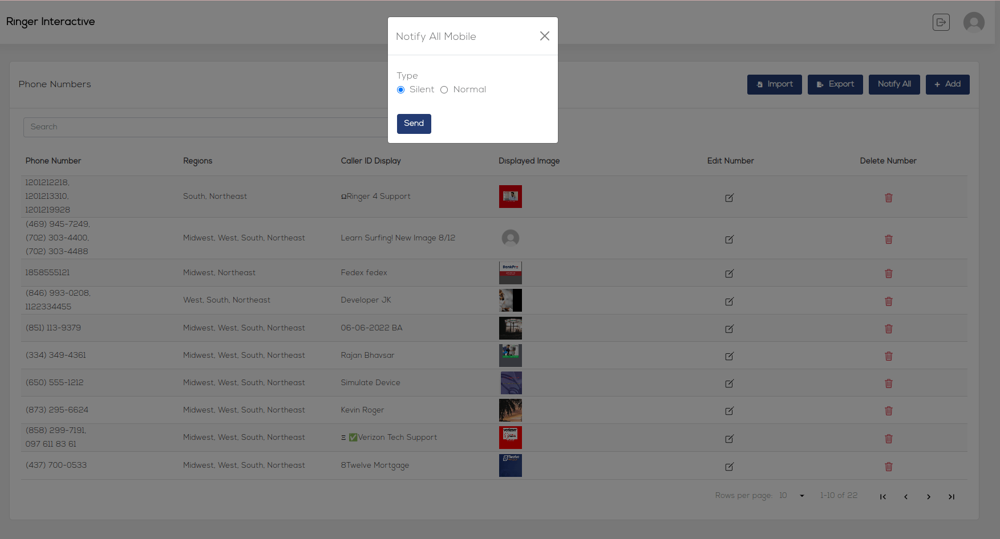
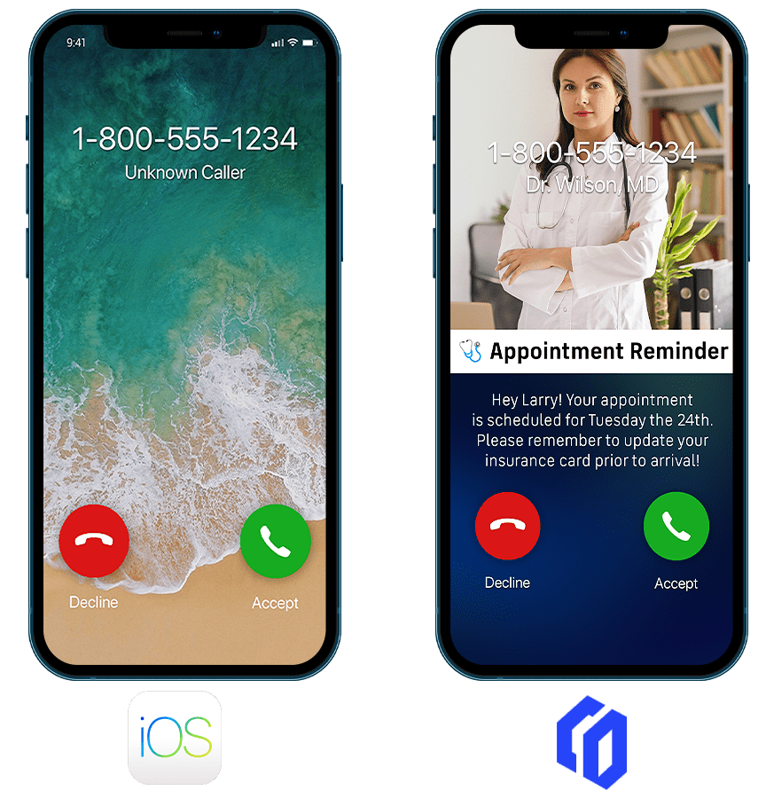
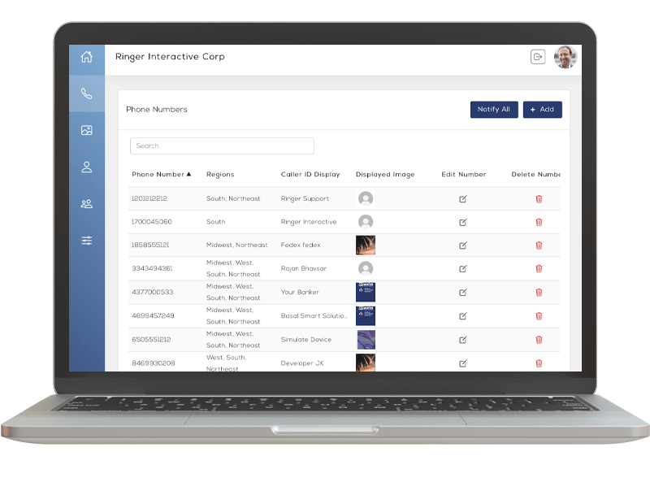
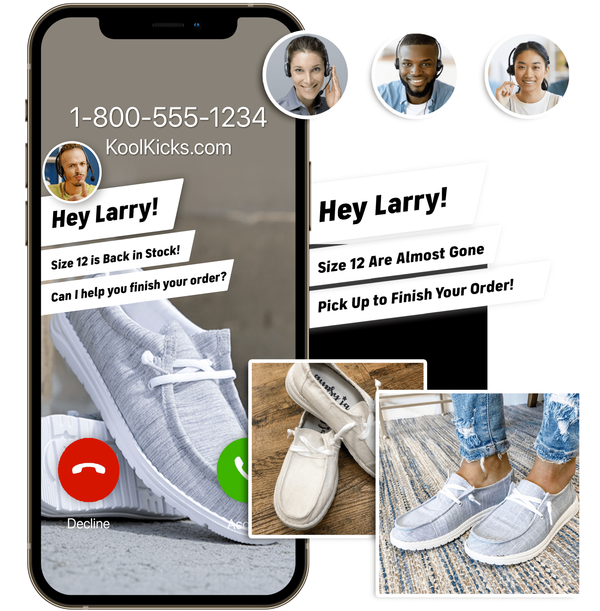
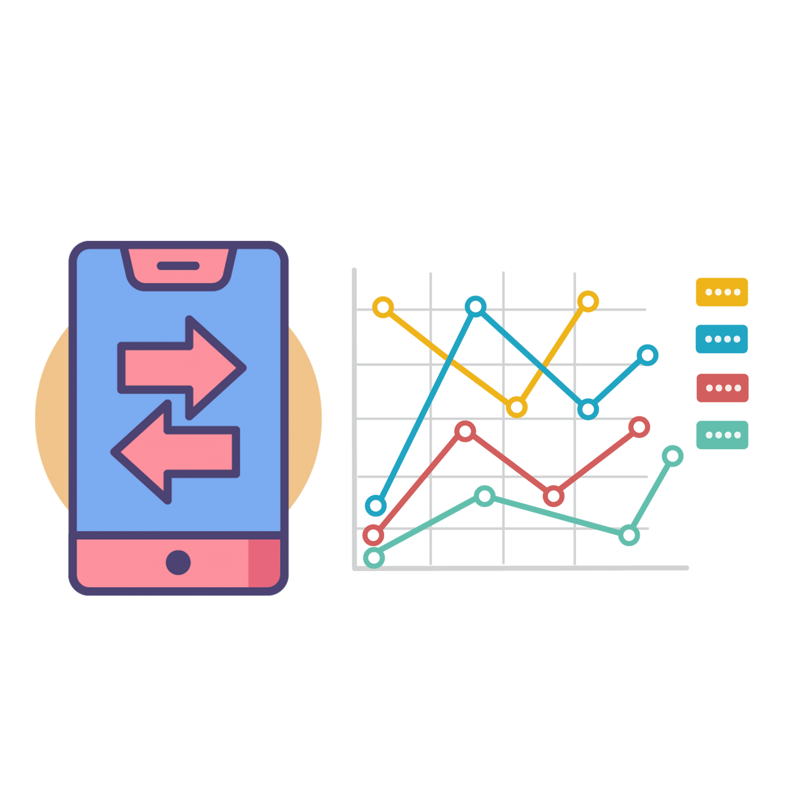

# Intro

Let's discover **Ringer Interactive in less than 5 minutes**.

## Getting Started

Register [**new Ringer account**](https://ringerinteractive.com/contact/).

### What you'll need

- Ringer account
- Mobile device Android or iOS installed Flash App
  - Google PlayStore : [Ringer Android App](https://play.google.com/store/apps/details?id=com.ringer)
  - App Store : [Ringer iOS App](https://apps.apple.com/vn/app/ringer-interactive-app/id1628828448?l=vi)

### Add new contact on Admin Portal

- Login to Ringer Portal

- Add contact to Ringer

- Start notify update contact for all device

## Ringer Feature

### From “Unknown Caller” To Answered Call
 Nearly 90% of consumers don’t answer calls from unknow numbers.
With more than 50.5 billion robocalls made in 2021, can you blame them?

- Problem 1:
To help protect consumers from telephone fraud, the FCC says, “Don't answer calls from unknown numbers.” And people don’t.
- Problem 2:
Because of this, consumers are missing important calls – appointment reminders, school closures, flight delays, test results and more.
- Problem 3:
Scammers, spoofers and fraudsters have made it nearly impossible for legitimate businesses to connect with customers.

- Problem 4:
Even though consumers consider the phone their channel of choice, they don’t trust it.

### Our Solution
- RINGER INTERACTIVE CALLER ID™
GOES BEYOND BRANDED TO DELIVER TRUSTED CALLS THROUGH A PERSONALIZED, FULL-SCREEN DISPLAY THAT: Quickly identifies your brand so customers can answer the calls they want and need.Significantly increases your answer and first-call resolution rates. Transforms the phone screen into a personalized, actionable message customers won’t ignore, silence or send to voicemail.

- Answered Calls - Reduce Blocked Calls And Increase Answer Rates.
Ringer Interactive Caller ID™ increases answer rates, helping ensure your customers get the information they need while strengthening their relationship with you. Add a full-screen personalized message and call-to-action and watch resolution rates soar.

- Increased Trust - Restore Customer Confidence And Help Prevent Phone Scams
Ringer Interactive can help prevent calls from being labeled as spam with phone number registration, reputation monitoring, and improper blocking and labeling prevention and remediation.

- Powerful Data - Access Call Performance Insights To Drive Better Informed Business Decisions
Ringer Interactive offers insights and analytics from call origination to destination. By working with analytics companies, we provide visibility and control of how your calls are presented to consumers.

## Calls Aren’t Just Answered, They’re Resolved.
Branded calls help increase answer rates, but Ringer Interactive goes beyond branded with full-screen, personalized messages.

Ringer’s patented Interactive Caller ID™ automatically delivers each customer a personalized call-to-action. Customers see the reason for your call while the phone is ringing and can then easily resolve issues such as appointment confirmations, subscription renewals and more. What used to take several unanswered calls and call-backs can now be done through one personalized, branded call.