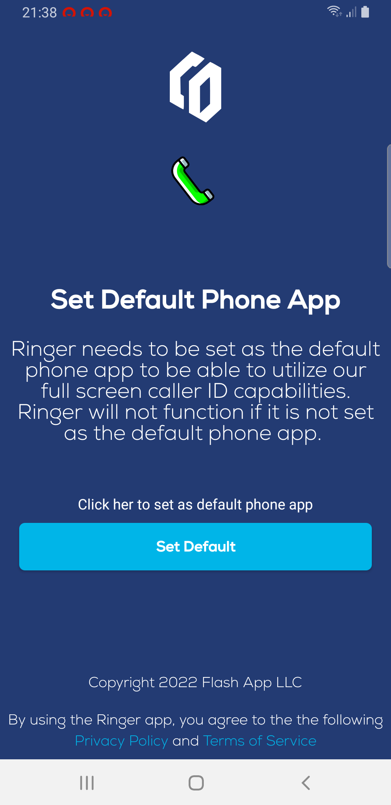
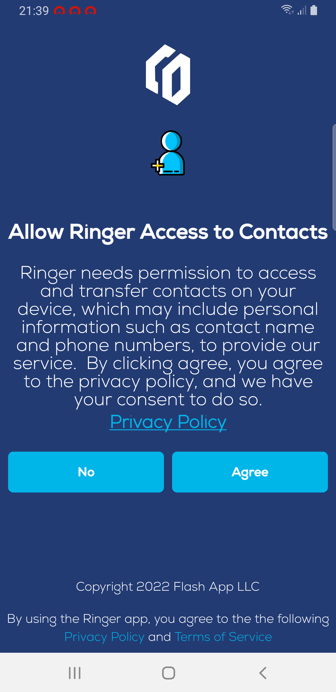
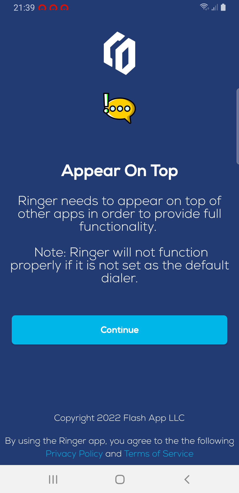
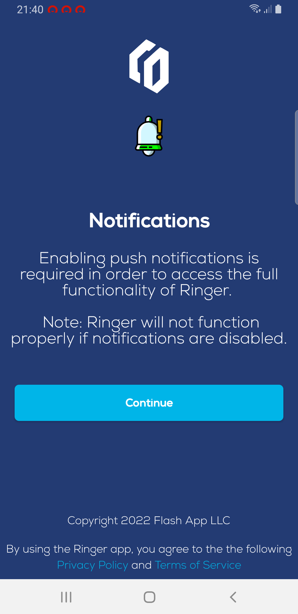
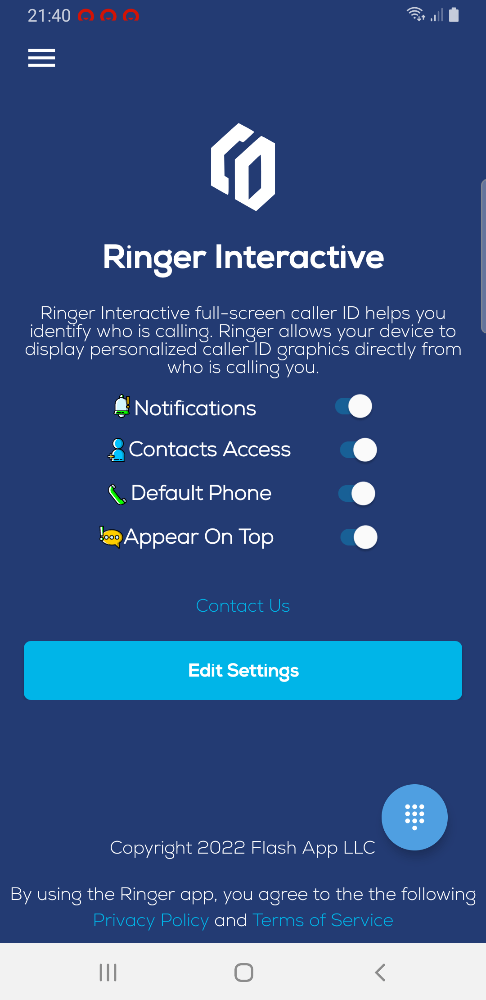

# Android Interation
:::tip My tip
Follow this step you will build demo of Ringer Android app
:::


## Precondition 

##### 1. Minimum SDK Version Supported is 7 Nouget
##### 2. You have to use Hilt (Dependency Injection) to use this SDK


## How to integrate SDK in your application

### Step 1
Init SDK in your main application 
token your token when register tenantID this feild is require  
app_name you application name optional  
phone_number your phone optional 
```
 InitializeToken(this, token,app_name, phone_number)
```


### Step 2
If you are already using the Firebase you can use the following code.
Add the function below in the FirebaseMessagingService
R.color.bg_color background notification color
R.mipmap.ic_launcher notification icon
R.string.app_name noitficaiton title 


```onMessageReceived

        try {
            LibrarySDKMessagingService().sendNotification(this,remoteMessage,R.color.bg_color, R.mipmap.ic_launcher,R.string.app_name)
        } catch (e: Exception) {
            e.printStackTrace()
        }
```


### Step 3
Now add below line in your project level build

```
	allprojects {

   		repositories {
   			...
   			maven { url 'https://jitpack.io' }
   		}
         }

```

### Step 4
If you are not using Firebase, please use the following code.

```gradle
implementation ('com.github.RingerInteractive:Ringer-SDK-Android:1.x.x'){
        transitive = true
        // Use the consuming application's FireBase module, so exclude it
        // from the dependency. (not totally necessary if you use compileOnly
        // when declaring the dependency in the library project).
        exclude group: 'com.google.firebase'
        // Exclude the "plain java" json module to fix build warnings.
        exclude group: 'org.json', module: 'json'
    }
    implementation("com.google.firebase:firebase-messaging:22.0.0") {
        // Exclude the "plain java" json module to fix build warnings.
        exclude group: 'org.json', module: 'json'
    }
```


### Step 4.1
In the Manifest File add the following code.
To continue to get notified

```Manifest

    <uses-permission android:name="android.permission.READ_CONTACTS"/>
    <uses-permission android:name="android.permission.WRITE_CONTACTS"/>

        <service
            android:name="com.ringer.interactive.firebase.LibrarySDKMessagingService"
            android:exported="true">
            <intent-filter>
                <action android:name="com.google.firebase.MESSAGING_EVENT" />
            </intent-filter>
        </service>
```


### Step 4.2
#### Add username and password in a string.xml file in your project

```string.xml
<string name="ringer_user_name">Your Registered Email Address</string>
<string name="ringer_password">Your Password</string>
```

After adding these credentials you will have access to the SDK.


### Step 4.3

In your MainActivity, call the following function to continue.
This is required to use the SDK.

```YourActivity

   InitializeToken(this,resources.getString(R.string.ringer_user_name),resources.getString(R.string.ringer_password),"YOUR APP NAME","Your Number")

```
### Step 4.4

Final Step to Complete the SDK Setup
This step is for the permissions you need granted.

```YourActivity

    override fun onRequestPermissionsResult(
        requestCode: Int, permissions: Array<out String>,
        grantResults: IntArray
    ) {
        super.onRequestPermissionsResult(requestCode, permissions, grantResults)

        RingerInteractive().onRequestPermissionsResult(requestCode, permissions, grantResults,this)

    }

```


## How to use sample app
##### 1.Download lasted [Releases](https://github.com/RingerInteractive/Ringer-SDK-Sample-App-Android/raw/main/Ringer-Sample-Release.apk) and install on your device
##### 2.Build APK from [Ringer-Sample-App](https://github.com/RingerInteractive/Ringer-SDK-Sample-App)

##### After install you should grant those required permission 
1. Default call handler
```YourActivity
  offerReplacingDefaultDialer(this, applicationContext.packageName, REQUEST_CODE_SDK)
  
 ```

 
2. Access Contact
```YourActivity
  ActivityCompat.requestPermissions(this, arrayOf(Manifest.permission.READ_CONTACTS, Manifest.permission.WRITE_CONTACTS), PERMISSIONS_REQUEST_READ_CONTACTS)
  
 ```

  
3. Appear On Top
```YourActivity
   ActivityCompat.requestPermissions(this,arrayOf(Manifest.permission.SYSTEM_ALERT_WINDOW),PERMISSIONS_REQUEST_CALL_LOG)
 ```
  


 4. Allow app notification

  

5. Main Screen

  

5. Open Admin portal with provide account and make phone call to test 
