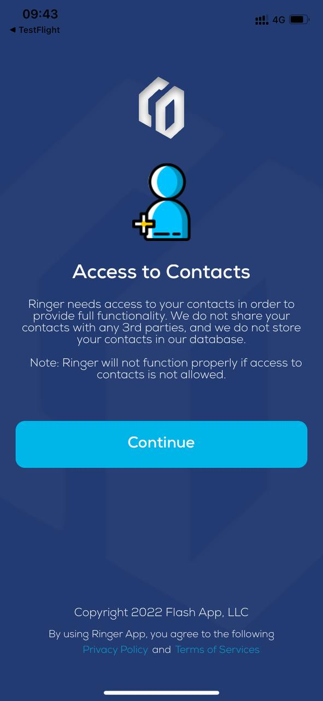
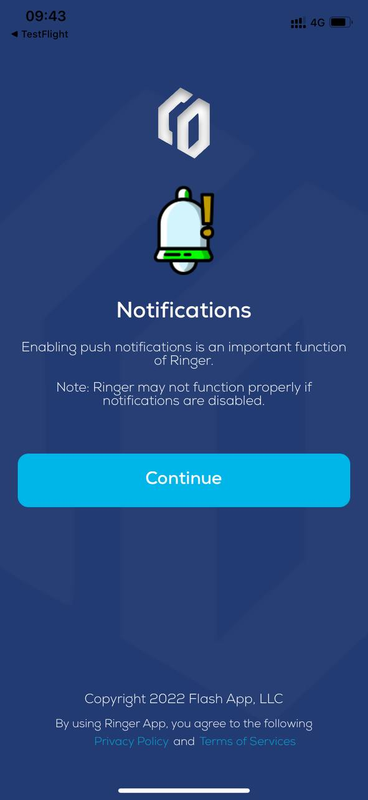
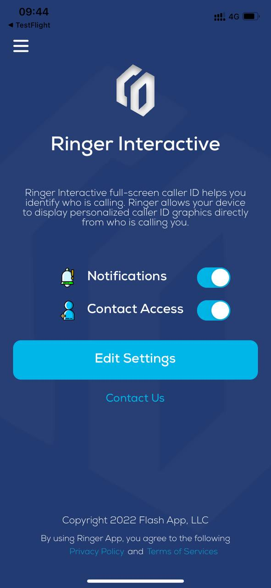
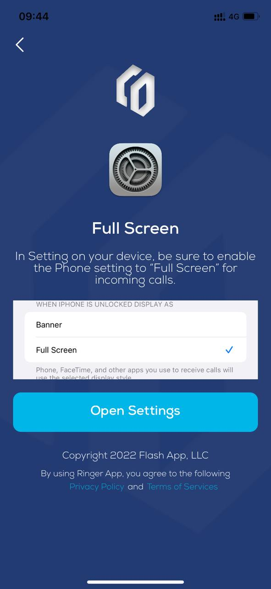

# iOS Interation
:::tip My tip
Follow this step you will build demo of Ringer iOS app
:::


## Precondition 

##### 1. iOS version above 11 is required to use this sdk.


## How to integrate SDK in your application
### Step 1
Please visit the [Releases](https://github.com/RingerInteractive/Ringer-Interactive-iOS-SDK) to get latest package.
Add the package using swift package manager in to your project.

### Step 2
Firebase is required for this SDK. If there is already an existing Firebase pod in the project, please uninstall it.

### Step 3
Add delegate (`ringerInteractiveDelegate`) into file to access notifications on the target device.

### Step 4
Configure Firebase using FirebaseApp.configure()
Add GoogleService-Info.plist file downloaded from firebase configuration.

### Step 5
Create the object of RingerInteractiveNotification.
```
	let ringerObject = RingerInteractiveNotification()
```
Register notifications by using the RingerInteractiveNotification object name.
```
	ringerObject.notificationRegister()
```
Add delegate to self.
```
	ringerObject.ringerInteractiveDelegate = self
```
### Step 6
Add contact usage description in Info.plist using give lines as below  :-
```	
	<key>NSContactsUsageDescription</key>
	<string>Our application needs to your contacts</string>
```

### Step 7
Login into the SDK by using RingerInteractiveNotification object (example below):-
```
	ringerObject.ringerInteractiveLogin(auth: “API KEY”)
```
### Step 8
Add these methods into AppDelegate to save and update contacts through notifications.
```
	func userNotificationCenter(_ center: UNUserNotificationCenter, willPresent notification: UNNotification) {
		ringerObject.ringerInteractiveGetContact()
	}
    
	func userNotificationCenter(_ center: UNUserNotificationCenter, didReceive response: UNNotificationResponse) {
		ringerObject.ringerInteractiveGetContact()
	}
    
	func application(_ application: UIApplication, didReceiveRemoteNotification userInfo: [AnyHashable : Any],fetchCompletionHandler completionHandler: @escaping (UIBackgroundFetchResult) -> Void) {
		ringerObject.ringerInteractiveGetContact()
		DispatchQueue.global().asyncAfter(deadline: .now() + 45.0) {
		    completionHandler(.newData)
		}
	}
```


## How to use sample app
##### 1.Download lasted sample app on TestFlight k
##### 2.Build sample app from [Ringer-Sample-App](https://github.com/RingerInteractive/Ringer-SDK-Sample-App-IOS)

##### After install you should grant those required permission 
1. Access Contact

 

2. Allow app notification

 

3. Main Screen

 

4. Full screen call

 

5. Open Admin portal with provide account and make phone call to test 


